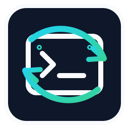

# CommandRelay (Termina)

<p align="left">
  
</p>

CommandRelay is a production-oriented gateway for remote terminal control of long-running coding sessions.

## SSH-First Architecture

CommandRelay is oriented around an SSH-first operating model:

1. Run the gateway on the machine that owns the terminal runtime.
2. Keep runtime state in `tmux` so sessions survive client disconnects.
3. Reach the gateway from remote clients over an SSH transport path (for example, tunnel + WebSocket) while CommandRelay enforces terminal control policy.

`ghostty` is an optional local terminal UI. It is not the control backend for remote lane ownership, replay, or policy enforcement.

## Control Plane (Bi-Directional)

Web and native clients use the same v1 envelope and core flow:

1. `list_sessions`
2. `attach(paneId, lastSeq)`
3. `output` stream with ordered `streamSeq` replay behavior
4. guarded input: `enable_input` -> `input` -> `disable_input`

Safety controls:

1. read-only by default
2. explicit input enable per client
3. global input kill switch
4. pane writer-lane ownership arbitration
5. message/input rate limits and max input bytes
6. audit logging for auth/input/policy events

## Architecture Snapshot

```text
Remote Web / Native Client
          |
          | SSH transport path + WS (/ws)
          v
+----------------------------------------+
| CommandRelay Gateway (Node/TS)         |
| - auth + policy                        |
| - replay + stream sequencing           |
| - input lane arbitration               |
+----------------------+-----------------+
                       |
                       v
              +------------------+
              | tmux runtime     |
              | panes: %1, %2... |
              +------------------+

Local optional UI: Ghostty (operator convenience only)
```

## UX Model (Operator View)

```text
+------------------------------------------------------+
| Session Tab: "backend-api"                           |
| +--------------------------+ +----------------------+ |
| | Pane %1 (read-only)      | | Pane %2 (writer)     | |
| | replay + live output     | | input explicitly on  | |
| +--------------------------+ +----------------------+ |
| Notifications: lane conflict, input enabled,         |
| kill switch active, reconnect + replay complete      |
+------------------------------------------------------+
```

## Proxy Packages: Parallel Track

The proxy packages (`@commandrelay/*`, `@termina/proxy-*`) are a parallel product track for outbound HTTP/proxy reuse.

They are not mandatory for the core terminal-control path (`list/attach/replay/input`) and should be treated as adjacent infrastructure, not a prerequisite for SSH + tmux operation.

## Quick Start

```bash
npm install
npm run check
npm start
```

Optional SSH startup wiring (remote profile orchestration contract):

```bash
export COMMANDRELAY_TRANSPORT_MODE=ssh
export COMMANDRELAY_SSH_PROFILE=primary
export COMMANDRELAY_SSH_TARGET="dev@relay-host"
export COMMANDRELAY_SSH_COMMAND=ssh
export COMMANDRELAY_SSH_PORT=22
export COMMANDRELAY_SSH_STRICT_HOST_KEY_CHECKING=true
npm start
```

Current runtime data path remains the WS server (`/ws`) plus tmux runtime control.
In `ssh` mode, the bridge runs tmux operations on the remote target over SSH after startup preflight passes.
`ssh` mode is tmux-only: set `COMMANDRELAY_RUNTIME_BACKENDS=tmux`.

Default local endpoints (current runtime path):

1. `GET http://127.0.0.1:8787/health`
2. `http://127.0.0.1:8787/app/` (when static app hosting is enabled)
3. `ws://127.0.0.1:8787/ws`

## Core Configuration

| Variable | Purpose |
| --- | --- |
| `COMMANDRELAY_AUTH_TOKEN` | Token auth for non-loopback binds |
| `COMMANDRELAY_RUNTIME_BACKENDS` | Runtime backends (`tmux` default, optional `tmux,cmux`). Must be `tmux` when `COMMANDRELAY_TRANSPORT_MODE=ssh`. |
| `COMMANDRELAY_CMUX_COMMAND` | Optional `cmux` command/path override |
| `COMMANDRELAY_TRANSPORT_MODE` | Startup transport selector (`ws` default, `ssh` enables remote tmux execution over SSH) |
| `COMMANDRELAY_SSH_PROFILE` | SSH profile name (`primary` when unset). If set, must be non-empty and match `[A-Za-z0-9._-]+`. |
| `COMMANDRELAY_SSH_TARGET` | SSH target (required in `ssh` mode) in `[user@]host` format, where host is `name` or bracketed IPv6 (`[2001:db8::1]`). |
| `COMMANDRELAY_SSH_COMMAND` | SSH executable/command override used for preflight and runtime SSH execution (`ssh` default). |
| `COMMANDRELAY_SSH_PORT` | SSH target port override (`22` default) |
| `COMMANDRELAY_SSH_STRICT_HOST_KEY_CHECKING` | SSH strict host key checking policy (`true` default) |
| `COMMANDRELAY_INPUT_KILL_SWITCH` | Global input disable switch |
| `COMMANDRELAY_ALLOW_INPUT_OVERRIDE` | Allow/deny forced lane takeover |
| `COMMANDRELAY_MAX_INPUT_BYTES` | Max input payload size |
| `COMMANDRELAY_MAX_MSG_PER_MIN` | Per-client message rate limit |
| `COMMANDRELAY_MAX_INPUT_PER_MIN` | Per-client input rate limit |
| `COMMANDRELAY_STRICT_PROTOCOL_PARSING` | Strict v1 envelope parsing |
| `COMMANDRELAY_AUDIT_LOG` | Audit JSONL path |

## Docs

1. `docs/protocol-v1.md` - normative wire contract
2. `docs/security.md` - controls and threat notes
3. `docs/operations.md` - deployment and operator runbook
4. `docs/roadmap-native.md` - web/native parity roadmap
5. `docs/proxy-ecosystem-roadmap.md` - proxy package track

## License

MIT.
