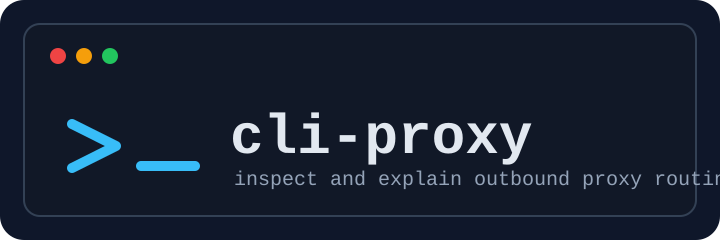

# @termina/cli-proxy



Proxy diagnostics CLI for inspecting proxy-related environment variables and explaining route decisions for outbound URLs.

## Install

```bash
npm install @termina/cli-proxy @commandrelay/proxy-core
```

Optional agent-level explain details:

```bash
npm install @commandrelay/proxy-agent
```

## Runtime

- Node.js `>=18`
- npm `>=9`
- ESM package (`"type": "module"`)

## CLI

Binary names:

- `termina-cli-proxy`
- `termina-proxy`

### Commands

```bash
termina-cli-proxy env [--json]
termina-cli-proxy explain [--json] [--with-agent|--no-agent] <url...>
termina-cli-proxy help
```

### `env`

Inspects:

- `http_proxy` / `HTTP_PROXY`
- `https_proxy` / `HTTPS_PROXY`
- `all_proxy` / `ALL_PROXY`
- `no_proxy` / `NO_PROXY`
- `REQUEST_METHOD` / `request_method`

Then shows normalized `@commandrelay/proxy-core` settings.

### `explain`

For each URL, reports:

- route decision (`proxy`, `direct`, or `error`)
- selected proxy URL and source setting
- matched `NO_PROXY` rule (if any)
- optional `@commandrelay/proxy-agent` agent class metadata

### JSON mode

Use `--json` for machine-readable output:

```bash
termina-cli-proxy explain --json https://example.com https://api.internal.local
```

## Programmatic API

```ts
import {
  inspectProxyEnvironment,
  explainProxyRoutes,
  parseCliArgs,
  runCli
} from "@termina/cli-proxy";

const inspection = inspectProxyEnvironment(process.env);
const explain = await explainProxyRoutes(["https://example.com"], {
  env: process.env,
  enableAgent: true
});

console.log(inspection.settings.httpProxy, explain.routes[0]?.decision);
```

## Examples

- Overview: [docs/examples/README.md](./docs/examples/README.md)
- Environment inspection: [docs/examples/env.md](./docs/examples/env.md)
- Route explanation: [docs/examples/explain.md](./docs/examples/explain.md)

## Notes

See [NOTES.md](./NOTES.md) for integration guidance.
