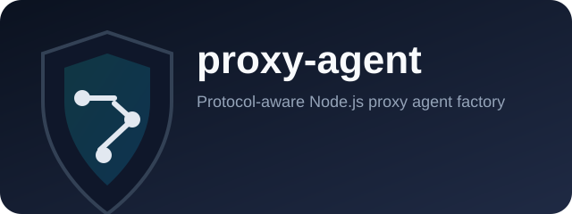

# @commandrelay/proxy-agent



Protocol-aware proxy agent factory for Node.js clients that accept `http.Agent`/`https.Agent`.

- Supports `http`, `https`, `socks*`, and `pac+*` proxy URLs
- Resolves routing from standard proxy env vars (`HTTP_PROXY`, `HTTPS_PROXY`, `ALL_PROXY`, `NO_PROXY`)
- Reuses agents with bounded cache for low overhead across repeated requests

## Install

```bash
npm install @commandrelay/proxy-agent
```

## Runtime

- Node.js `>=18`
- npm `>=9`
- ESM package (`"type": "module"`)

## Version support policy

- Current line: `0.1.x`
- While pre-`1.0`, pin minor versions in production (`~0.1.0`).

## Export surface

- `@commandrelay/proxy-agent` (root API)
- `@commandrelay/proxy-agent/package.json` (metadata only)
- Deep imports such as `@commandrelay/proxy-agent/dist/*` are intentionally unsupported.

## External Reuse

This package is designed for proxy-agent style consumers: libraries/services that need a per-target Node agent.

Integration note: [NOTES.md](./NOTES.md)

### Generic adapter for agent-based HTTP clients

```ts
import { ProxyAgentFactory } from "@commandrelay/proxy-agent";

const factory = new ProxyAgentFactory({
  env: process.env,
  maxCacheEntries: 256,
  agentOptions: {
    http: { keepAlive: true },
    https: { keepAlive: true },
    tls: {
      rejectUnauthorized: true,
      minVersion: "TLSv1.2"
    }
  }
});

export function resolveAgent(target: string | URL) {
  const { agent } = factory.resolve(target);
  return agent ?? undefined;
}
```

### Adapter examples

- Overview: [docs/examples/README.md](./docs/examples/README.md)
- Axios: [docs/examples/axios.md](./docs/examples/axios.md)
- Undici: [docs/examples/undici.md](./docs/examples/undici.md)
- Got: [docs/examples/got.md](./docs/examples/got.md)
- Fetch (Node.js): [docs/examples/fetch.md](./docs/examples/fetch.md)

## Usage Matrix

| Integration context | Recommended package | Reason |
| --- | --- | --- |
| Axios, Got, or custom `http`/`https` clients that accept Node agents | `@commandrelay/proxy-agent` | Returns protocol-correct `http.Agent`/`https.Agent` with cache + env routing |
| Node `fetch`/Undici code expecting a `dispatcher` | Prefer `@commandrelay/proxy-undici` or `@commandrelay/proxy-fetch` | Those integrations are dispatcher-native |
| Need SOCKS or PAC proxy URL support in Node clients | `@commandrelay/proxy-agent` | Supports `socks*` and `pac+*` schemes |
| Need policy-only decision logic without creating agents | Prefer `@commandrelay/proxy-core` | Keeps routing logic decoupled from transport runtime |

## API

```ts
interface ProxyAgentResolution {
  agent: import("node:http").Agent | null;
  proxyUrl: string | null;
  viaProxy: boolean;
  fromCache: boolean;
}

interface ProxyAgentFactoryOptions {
  settings?: ProxySettings;
  env?: ProxyEnvironment;
  maxCacheEntries?: number;
  agentOptions?: ProxyAgentConstructorOptions;
}

class ProxyAgentFactory {
  constructor(options?: ProxyAgentFactoryOptions);
  resolve(target: string | URL): ProxyAgentResolution;
  updateSettings(settings: ProxySettings): void;
  reloadFromEnvironment(env?: ProxyEnvironment): ProxySettings;
  clear(): void;
  destroy(): void;
  dispose(): void;
  get cacheSize(): number;
}
```

Also exported:

- `createProxyAgent(proxyUrl: string, targetProtocol: string): Agent`
- `loadProxySettings(env?: ProxyEnvironment): ProxySettings`
- `resolveProxyForUrl(target: string | URL, settings: ProxySettings): string | null`
- `shouldBypassProxy(target: URL, rules: NoProxyRule[]): boolean`
- `parseNoProxy(raw: string): NoProxyRule[]`
- Types: `NoProxyRule`, `ProxyEnvironment`, `ProxySettings`, `ProxyAgentFactoryOptions`, `ProxyAgentResolution`, `ProxyAgentConstructorOptions`, `ProxyAgentTlsOptions`

`ProxyAgentTlsOptions` is also exported for shared trust policy:

```ts
type ProxyAgentTlsOptions = {
  rejectUnauthorized?: boolean;
  ca?: string | Array<string | Buffer> | Buffer;
  cert?: string | Array<string | Buffer> | Buffer;
  key?: string | Array<string | Buffer> | Buffer;
  pfx?: string | ArrayBuffer | ArrayBufferView | Array<string | Buffer>;
  passphrase?: string;
  minVersion?: string;
  maxVersion?: string;
};
```

## Security and Ops

- Lowercase env vars override uppercase counterparts
- In CGI-like environments (`REQUEST_METHOD` set), uppercase `HTTP_PROXY` is ignored
- `NO_PROXY` supports domain/host rules, wildcard-style entries, IPv4/IPv6, and optional ports
- Do not log proxy URLs containing credentials
- PAC URLs are executable policy; only use trusted PAC sources

## Migration and Compatibility

- Runtime baseline: Node.js `>=18`, npm `>=9`, ESM package usage.
- If migrating from client-specific proxy flags, centralize routing with one `ProxyAgentFactory`.
- Disable overlapping built-in proxy layers in clients (for example Axios `proxy: false`) to avoid double-proxy behavior.
- Use root imports only (`@commandrelay/proxy-agent`); deep imports are not compatibility-safe.
- While pre-`1.0`, pin minor versions (`~0.1.x`) before production rollouts.

## Troubleshooting

- Traffic unexpectedly direct (`viaProxy=false`): verify `HTTP_PROXY`/`HTTPS_PROXY`/`ALL_PROXY` and `NO_PROXY` rules for the target.
- Axios requests fail or ignore agent: ensure request config sets `proxy: false` when passing agents.
- Settings changed but behavior did not: call `reloadFromEnvironment()` and/or `clear()` to refresh cache decisions.
- PAC/SOCKS proxy not working: confirm proxy URL scheme is valid and supported (`pac+*`, `socks*`, `http`, `https`).

## Performance

- Default cache size is `256`
- Set `maxCacheEntries: 0` to disable caching
- Reuse one long-lived `ProxyAgentFactory` per process/service
- Call `reloadFromEnvironment()` when proxy env settings rotate
- Call `destroy()`/`dispose()` on shutdown to close cached agents
