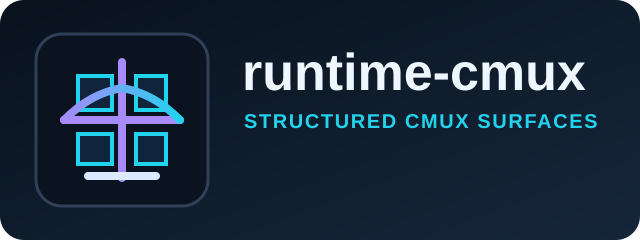

# @commandrelay/runtime-cmux



`runtime-cmux` provides the cmux-backed runtime adapter for CommandRelay.
Use it when the terminal surfaces you need are exposed through cmux and you want them normalized into runtime panes.

A compact cmux adapter for normalized pane control inside CommandRelay.

## Install

```bash
npm install @commandrelay/runtime-cmux
```

## Runtime

- Node.js `>=18`
- npm `>=9`
- ESM only (`"type": "module"`)

## Product Surface

- cmux surface discovery
- Pane row normalization
- Input forwarding to discovered panes
- Capture helpers for cmux-exposed terminal state

## Use When

- Your runtime host already publishes cmux surfaces.
- You need to translate cmux output into CommandRelay panes.
- You want a lightweight adapter around a structured cmux listing.

## Source Layout

- `src/index.ts`: cmux adapter export surface
- `CmuxRuntimeAdapter`: primary runtime adapter
- `CmuxRuntimePane`: pane shape returned by the adapter
- `CmuxRuntimeAdapterOptions`: adapter configuration

## Notes

- Keep this package focused on cmux-specific translation.
- Reuse `runtime-core` for shared command and pane abstractions.
