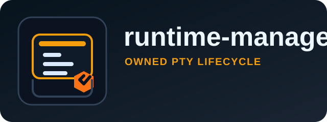

# @commandrelay/runtime-managed



`runtime-managed` provides the managed PTY backend for CommandRelay.
Use it when the runtime owns the process lifecycle and can start, monitor, and clean up panes on your behalf.

Managed PTY control for host-owned terminals with cleanup-aware lifecycles.

## Install

```bash
npm install @commandrelay/runtime-managed
```

## Runtime

- Node.js `>=18`
- npm `>=9`
- ESM only (`"type": "module"`)

## Product Surface

- Managed PTY session handling
- Daemon-aware availability checks
- Pane capture and input forwarding
- Lifecycle helpers for owned terminals

## Use When

- You want CommandRelay to manage local terminal state.
- You need automatic startup and readiness checks.
- You prefer a backend that can own pane cleanup and reconnection flow.

## Source Layout

- `src/index.ts`: managed adapter export surface
- `ManagedRuntimeAdapter`: primary runtime adapter
- `ManagedRuntimePane`: pane shape returned by the adapter
- `ManagedRuntimeAdapterOptions`: adapter configuration

## Notes

- Keep this package thin and adapter focused.
- Pair it with `runtime-core` for shared command and pane contracts.
