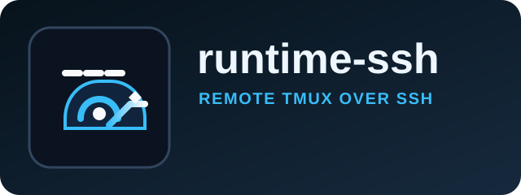

# @commandrelay/runtime-ssh



`runtime-ssh` connects CommandRelay to remote tmux sessions over SSH.
Use it when you need remote execution, host fingerprint checks, and pane control across a network boundary.

Remote tmux access over SSH with host checks and pane control.

## Install

```bash
npm install @commandrelay/runtime-ssh
```

## Runtime

- Node.js `>=18`
- npm `>=9`
- ESM only (`"type": "module"`)

## Product Surface

- SSH session bootstrap
- Remote tmux discovery and control
- Host fingerprint verification
- Pane capture and input forwarding over SSH

## Use When

- The runtime lives on a remote host.
- You need to verify the remote machine before connecting.
- You want tmux pane access without running the client locally.

## Source Layout

- `src/index.ts`: ssh adapter export surface
- `SshTmuxRuntimeAdapter`: primary runtime adapter
- `SshTmuxRuntimePane`: pane shape returned by the adapter
- `SshTmuxRuntimeAdapterOptions`: adapter configuration

## Notes

- Keep SSH transport concerns isolated in this package.
- Reuse `runtime-core` for command and runtime abstractions.
