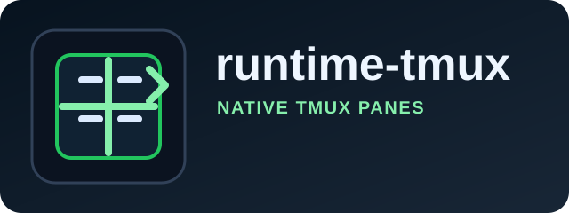

# @commandrelay/runtime-tmux



`runtime-tmux` connects CommandRelay to tmux-backed terminals.
Use it when you want native tmux session continuity, pane targeting, and shell state that survives disconnects.

Native tmux continuity for long-lived terminal sessions.

## Install

```bash
npm install @commandrelay/runtime-tmux
```

## Runtime

- Node.js `>=18`
- npm `>=9`
- ESM only (`"type": "module"`)

## Product Surface

- tmux session discovery
- Pane capture and input forwarding
- Attach and detach friendly runtime behavior
- Terminal multiplexing on existing tmux hosts

## Use When

- The host already runs tmux.
- You want to keep terminal state alive between client connections.
- You need a thin adapter that speaks tmux commands and panes.

## Source Layout

- `src/index.ts`: tmux adapter export surface
- `TmuxRuntimeAdapter`: primary runtime adapter
- `TmuxRuntimePane`: pane shape returned by the adapter
- `TmuxRuntimeAdapterOptions`: adapter configuration

## Notes

- Keep tmux-specific logic in this package.
- Reuse `runtime-core` for shared command execution and pane contracts.
